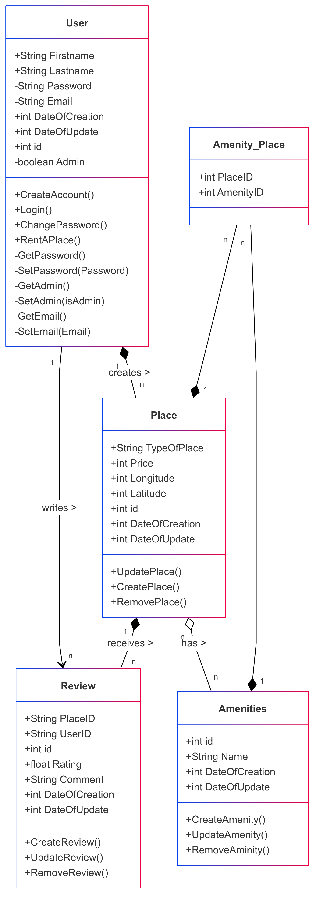
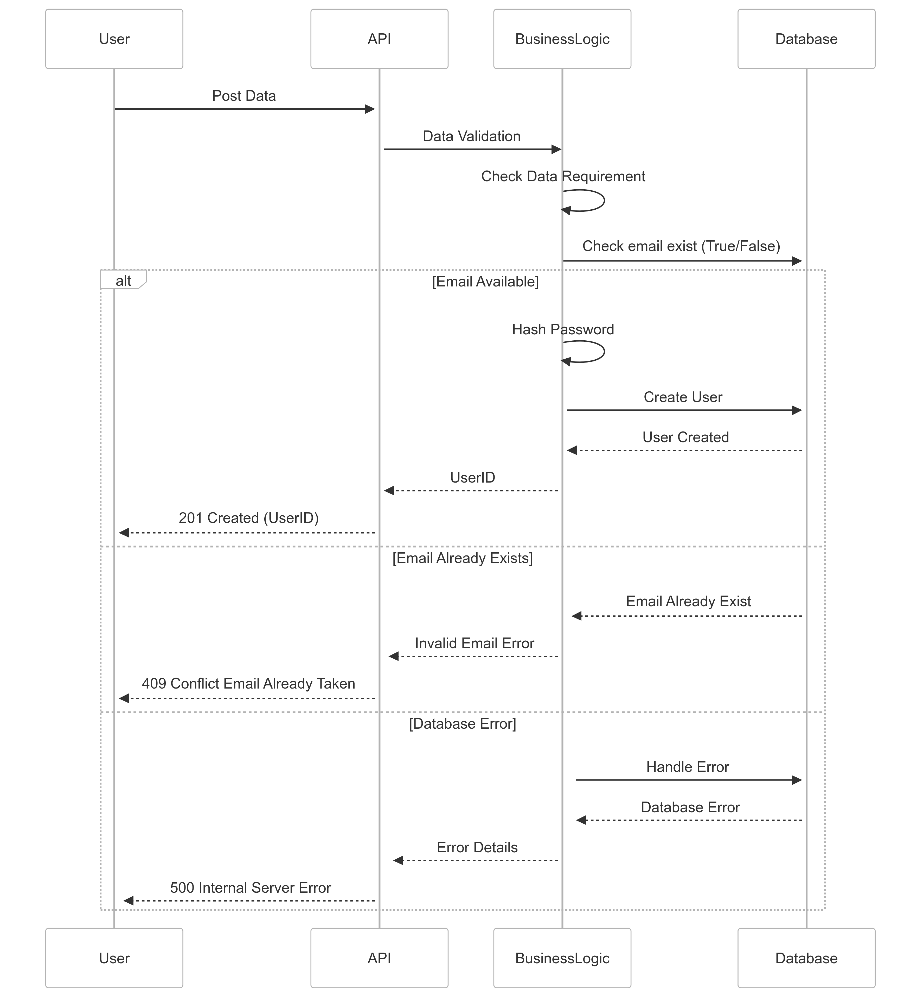
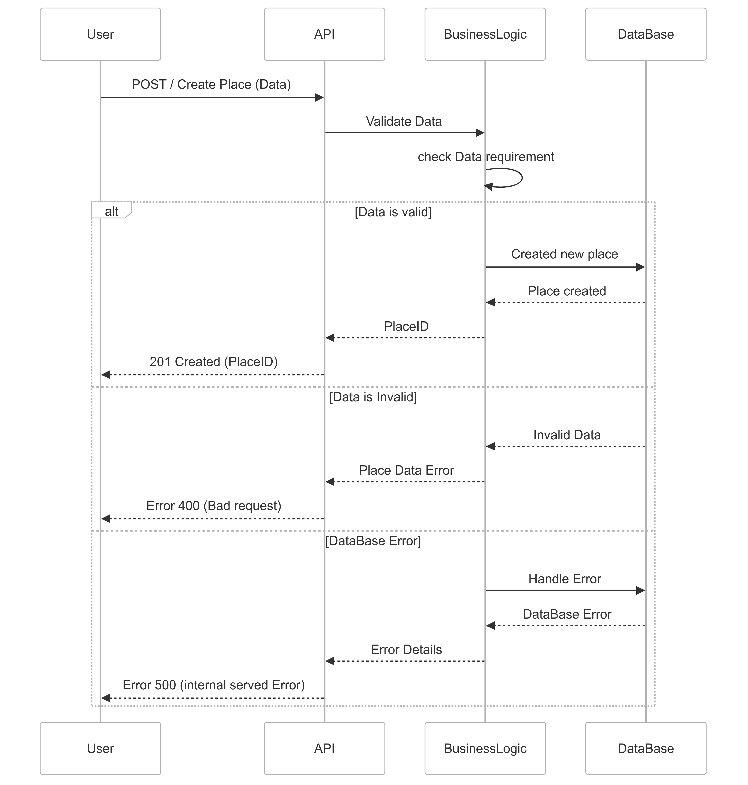
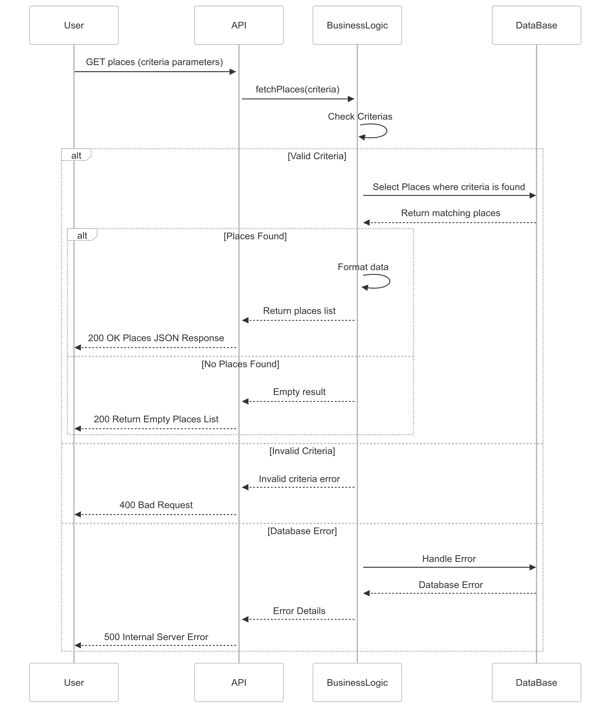

# High-level Package diagram:

This is the high-level package diagram that illustrates the three-layer architecture of the application and the communication between these layers via the facade pattern.

# Class Diagram:

This is the class diagram for the Business Logic layer, focusing on the User, Place, Review, and Amenity entities, including their attributes, methods, and relationships. And which also includes the relationships between Places and Amenities.

# Sequence Diagram: User create an account

This sequence diagram illustrates the user registration process in the HBnB platform. The diagram shows the complete flow from initial user data submission through validation, email verification, password security, and account creation, including error handling for existing email addresses.

### Main Success Scenario
1. User submits registration data via POST request
2. API forwards data for validation
3. Business logic validates requirements
4. Database confirms email availability
5. Password is securely hashed
6. User account is created
7. UserID is returned to client

### Alternative Flow
1. **Email Already Exists**
   - Database finds existing email
   - Returns conflict error
   - User receives 409 status code
   - Registration is prevented

2. **Database Error**
   - System cannot access place data
   - Returns 500 status with error information
   - Ensures proper error handling for system failures

# Sequence Diagram : User Create a new Place listing

This Sequence Diagram illustrates the process of a User creating a new place listing. This process works when data is valid and storage functions correctly. Invalid data leads to user errors while system failures cause server errors.

### Main Success Scenario
1. User submits Places Data via POST request
2. API forwards data for validation.
3. Business logic verifies requirements.
4. Database stores the new place.
5. A New Place is created.
6. API returns 201 Created with Place ID.

### Alternative Flow
1. **Invalide Data**:
   - Place data requirements are invalid.
   - Return Bad Request Error.
   - User receive 400 status code.
   - Place creation is prevented.

This approach ensures efficient and structured place creation with proper error handling.

2. **Database insertion fails**
   - API returns a 500 Internal Server Error.
   - Ensures proper error handling for system failures

# Sequence Diagram: User Review submission

Users can leave reviews for places they have visited, including a rating and a comment.
This sequence diagram illustrates the process to submit a review for a place by the user in the HBnB platform. The diagram shows the complete flow from initial user data submission through validation, including error handling.

### Main Success Scenario
1. User sends a POST request to the API to submit a comment.
2. The API checks if the user is authenticated.
3. The API forwards the request to the BusinessLogic for validation and processing of the review.
4. The BusinessLogic validates the content of the review.
5. The BusinessLogic inserts the review into the database.
6. The database returns a success response (with the review ID) to the BusinessLogic.
7. The BusinessLogic forwards the review ID to the API.
8. The API returns a 201 Created response to the user with the review ID.

### Alternative Flow
1. **User not logged in**
   - the API stops the process and returns a 401 Unauthorized response directly to the user.

2. **Review validation fails**
   - The BusinessLogic returns a 400 Bad Request response to the API because the review validation fails.
   - The API returns a 400 Bad Request response to the user.

3. **Database insertion fails**
   - API returns a 500 Internal Server Error.
   - Ensures proper error handling for system failures

# Sequence Diagram : User Fetching Places

This sequence diagram illustrates the process of fetching a list of places in the HBnB booking system. The diagram demonstrates the interaction flow between the user interface, API layer, business logic, and database when retrieving place listings based on search criteria.

### Main Success Scenario
1. User sends GET request with search criteria
2. API forwards request to business logic
3. Business logic validates criteria
4. Database query executes with valid criteria
5. Results are formatted and returned to user

### Alternative Flows
1. **Empty Results**
   - Valid search with no matching places
   - Returns 200 status with empty list
   - Allows client to handle zero-result cases gracefully

2. **Invalid Criteria**
   - Search parameters fail validation
   - Returns 400 status with error details
   - Prevents unnecessary database queries

3. **Database Error**
   - System cannot access place data
   - Returns 500 status with error information
   - Ensures proper error handling for system failures
